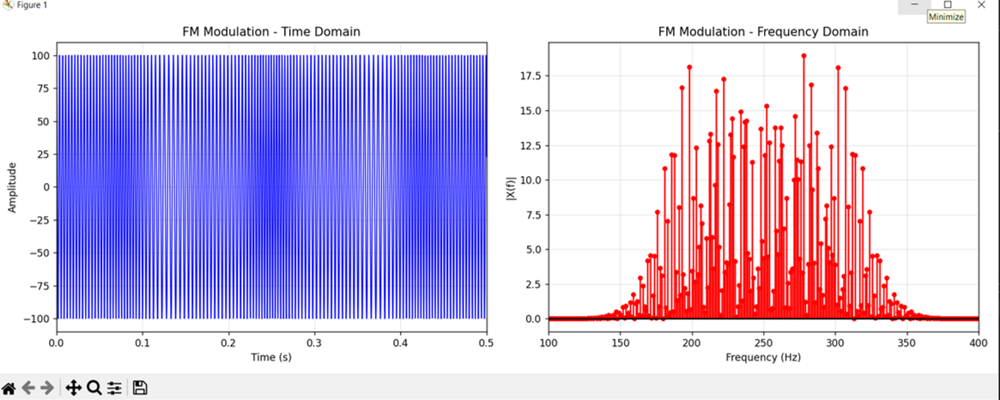
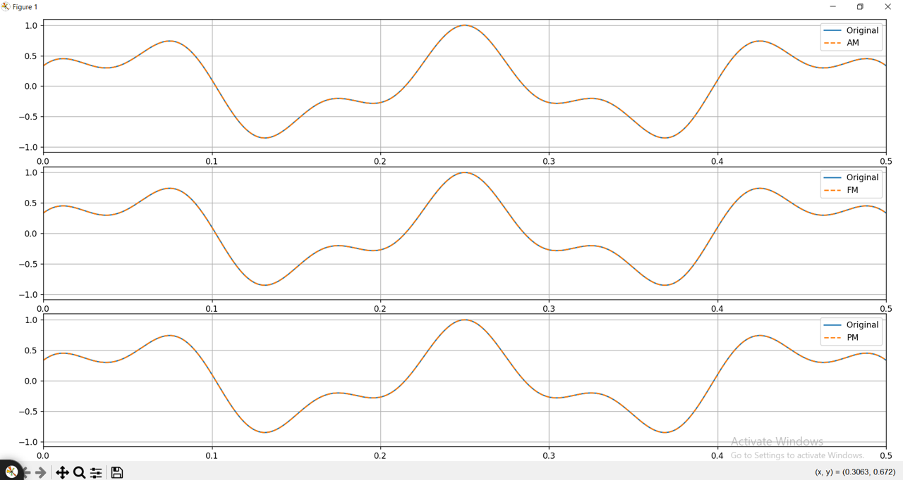

# Analog Communication System Simulation (AM, FM, PM)

A comprehensive Python-based end-to-end simulation of analog communication chains. This project covers the entire process of signal generation, modulation, noise analysis, and high-precision digital demodulation.

## 🚀 Overview
This repository contains a full simulation of:
* [cite_start]**Signal Analysis:** Defining complex multi-tone message signals and calculating power/energy.
* [cite_start]**Modulation Schemes:** Implementation of Amplitude Modulation (DSB-FC), Frequency Modulation (FM), and Phase Modulation (PM).
* [cite_start]**Noise Modeling:** Evaluation of system performance under Additive White Gaussian Noise (AWGN) with various SNR levels.
* [cite_start]**Advanced Demodulation:** Signal recovery using Hilbert Transform for instantaneous phase and amplitude extraction.

---

## 📊 Key Results

### 1. Message Signal Analysis
[cite_start]The baseband signal is a multi-tone signal consisting of two frequencies (5 Hz and 12 Hz).

### 2. FM Modulation (Frequency Domain)
In FM, the frequency of the carrier changes according to the message amplitude. [cite_start]This creates a wideband spectrum with multiple sidebands.

### 3. Signal Recovery (Demodulation)
[cite_start]Using the **Hilbert Transform**, we successfully recovered the original message from the modulated carriers, even in the presence of noise.

---

## 🛠 Technical Implementation
### Modulation Parameters (Based on Python Code)
* **Sampling Frequency ($f_s$):** 10,000 Hz.
* **Carrier Frequency ($f_c$):** 250 Hz.
* **Carrier Amplitude ($A_c$):** 100.
* **FM Sensitivity ($f_{\Delta}$):** 50 Hz/V.
* **PM Sensitivity ($\phi_{\Delta}$):** $\pi/2$ rad/V.
* **AM Modulation Index ($\mu$):** 0.5.

### Demodulation Logic
* **AM:** Extracted via the magnitude of the analytic signal (Envelope Detection): `abs(hilbert(x))`.
* **PM:** Recovered by extracting the instantaneous phase and subtracting the carrier phase: `unwrap(angle(hilbert(x))) - (2*pi*fc*t)`.
* **FM:** Calculated by taking the time derivative of the unwrapped instantaneous phase to find frequency deviations.

---

## 📁 Repository Structure
* [cite_start]`telecommunication_simulation.py`: The main Python script containing all algorithms.
* `images/`: Contains all generated plots for time and frequency domains.
* `Report.pdf`: Detailed theoretical and practical analysis of the project.

## 💻 Requirements
* Python 3.x
* NumPy
* SciPy
* Matplotlib

---
*Developed as part of the Analog Communications course project.*